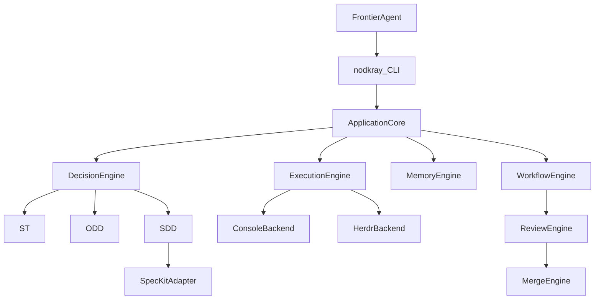
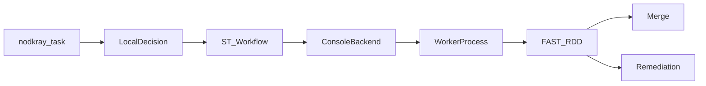

# NodKray V1 — Plan por fases

El repo hoy solo contiene [Docs/NodKrayDocs.md](Docs/NodKrayDocs.md). El spec ya cierra arquitectura, contratos y DoD de V1. Este plan no rediseña el sistema: lo parte en incrementos ejecutables.

Decisión de corte: **un crate binario** (`nodkray/`) con módulos de dominio, no un workspace multi-crate. Extraer crates solo si un módulo se vuelve independiente de verdad.

Decisión de paths (el spec se contradice en §47 vs §61):

- Config global: `~/.config/nodkray/config.yaml` (XDG)
- Datos: `~/.nodkray/` (`memory.db`, `logs/`, `cache/`)
- Config de proyecto: `.nodkray/config.yaml`

## Arquitectura que se respeta

Regla dura: CLI no habla SQL/Git/agente. Los workflows no llaman Herdr ni `specify` a pelo; pasan por `ExecutionBackend` y `SpecKitAdapter`.

## Fase 0 — Cimiento

**Entrega:** `nodkray init`, `nodkray doctor`, `nodkray config get|set`, `nodkray status` (vacío), `--json/--quiet/--verbose`, exit codes.

Crear el crate según §6:

- [src/main.rs](src/main.rs), [src/cli/](src/cli/), [src/config/](src/config/), [src/core/project/](src/core/project/)
- Error model tipado (`configuration`, `dependency`, `git`, …) + exit codes §125
- Logging con `tracing` a `~/.nodkray/logs/`
- Carga de config: CLI args > `NODKRAY_*` > project > user > defaults
- Schema YAML §62 (`version: 1`)
- `init --global|--project` idempotente: detecta Git/OS/arch, no pisa reglas existentes
- `doctor`: Git, SQLite (capacidad), agentes en PATH, Herdr/Spec-Kit/Sentrux como opcionales (`[--]` si ausentes)

Dependencias previstas: `clap`, `serde`+`serde_yaml`, `thiserror`, `tracing`+`tracing-subscriber`, `directories`, `ulid`, `chrono`.

Tests: init dos veces = mismo estado lógico; doctor no falla el proceso si falta Herdr; `--json` es JSON válido.

## Fase 1 — Persistencia y modelo de tarea

**Entrega:** SQLite + FTS5, IDs `task_<ulid>`, CLI de memoria, tareas persistentes.

- [src/memory/](src/memory/) con `MemoryRepository` (§102)
- Migraciones versionadas; tablas §49–§54 + `task_events`, `workers`, `reviews`, `review_checks`, `project_rules`
- FTS5 sobre `memories` con triggers
- Resolución de proyecto: cwd → repo root → `projects` (remote/path como atributos)
- `nodkray memory save|search|get|timeline` (search por proyecto; `--global` explícito)
- Estados de tarea §17 persistidos; `nodkray task inspect` y `nodkray status` leen SQLite

Todavía no se lanza ningún agente.

## Fase 2 — Rebanada ST (primer valor real)

**Entrega:** `nodkray task "..."` clasifica, ejecuta ST por consola, FAST RDD y merge explícito.

Implementar solo lo necesario:

- Traits: `AgentAdapter`, `ExecutionBackend` (§7, §13)
- Adapters: **Generic** + **uno real** (Claude `-p` o Codex headless; el resto queda stub `detect`)
- `ConsoleBackend`: spawn de proceso, cwd = worktree o working dir
- Worktree para ST solo si hay riesgo de escribir en main; default: un worktree por tarea
- Decision local: score §19 + umbrales `st_max: 20` / `odd_max: 60`. En esta fase, si el score > 20 se **rechaza** o se fuerza ST con warning; no se implementa ODD/SDD aún. Flag `--workflow st` para tests
- Contratos JSON: Agent Contract §76, Output Contract §77, Decision Schema §75
- RDD FAST: `git diff` + tests detectados (p.ej. `cargo test` si hay `Cargo.toml`) + reglas locales si existen
- Policy: check obligatorio ausente → `BLOCKED`/`FAILED`, nunca pass silencioso
- Merge por NodKray; conflicto → `CONFLICT` y no resolver
- `--yolo` solo relaja prompts del worker, no el flujo
- Snapshot de config al crear sesión

DoD de esta fase: en un repo de prueba, ST completa init → classify → worker → review → merge, recuperable tras matar el proceso (`status` sigue mostrando la tarea).

## Fase 3 — ODD y SDD

- ODD: `.nodkray/tasks/<task-id>/task.md` (§22) + RDD BALANCED
- SDD: `SpecKitAdapter` que invoca specify/plan/tasks/implement/converge; no reimplementar Spec-Kit
- Constitución: detectar/reusar `.specify/memory/constitution.md`; crear solo si falta y el usuario/init lo pide
- Si SDD y no hay Spec-Kit: provisionar o fallar con `dependency` (no silenciar a ST)
- Profundidad RDD por esfuerzo + `--review fast|balanced|deep`

## Fase 4 — Agentes, Herdr y paralelismo

- Adapters: Cursor, OpenCode, Claude, Codex, Pi + capabilities matrix (`agent list|inspect`)
- `HerdrBackend` detrás del mismo trait; fallback a console si Herdr `unavailable` y la config lo permite
- Roles → agente (§12); DAG de workers (§80–§81); worktrees `.nodkray/worktrees/<worker>`
- Eventos de worker persistidos; `worker list|inspect`
- Reviewer en worktree distinto cuando haga falta independencia

## Fase 5 — RDD completo e integraciones

- Validators: git, tests, lint, reglas, Sentrux opcional, review agent
- Verdict JSON §35 + policy §36
- Loop de remediación → REVIEWING
- Discovery MCP: Serena, CodeGraph, Sentrux (detectar, no wrappear)
- Skills en `skills/nodkray/` y bloque idempotente en `AGENTS.md`
- `nodkray mcp list|status`, `nodkray review|review inspect`

## Fase 6 — Remoto, JEV y cierre V1

- Control API opcional, `127.0.0.1:8787`, auth, HTTP + SSE/WS; **cero lógica de negocio en el cliente**
- JEV como `DecisionProvider` con validación de schema; fallback local
- Versionado de sesión (nodkray + agentes + speckit + herdr)
- Constitución del propio repo NodKray (distinta de la del target)
- Matriz de tests §115–§123 y DoD §173

Fuera de V1 (no planear código): TUI, dashboard web, Turso primario, billing, marketplace.

## Orden de implementación inmediato (cuando apruebes)

1. Scaffold Cargo + módulos vacíos + clap
2. Config/errors/logging/project discovery
3. `init` + `doctor` + tests de idempotencia
4. SQLite/FTS5 + CLI memoria
5. ST slice con Generic/Console + FAST RDD + merge

No abrir Herdr, Spec-Kit, remoto ni JEV hasta que ST pase en un repo de prueba.
